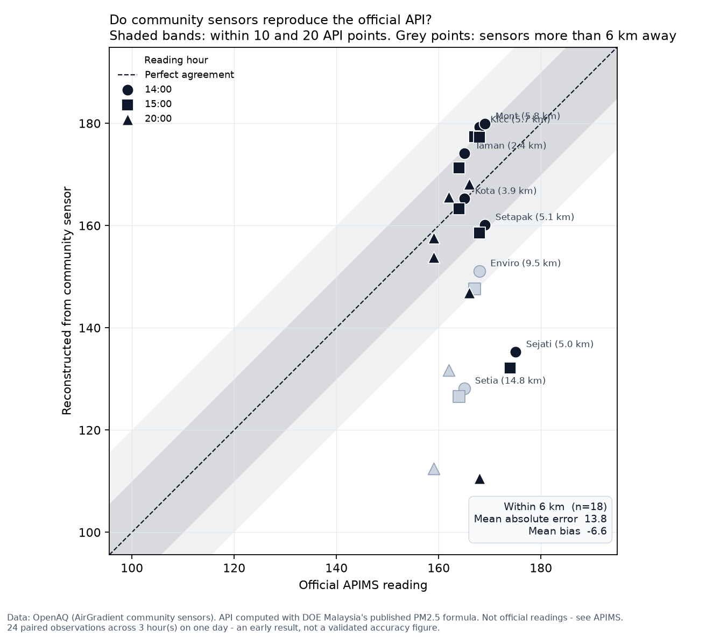
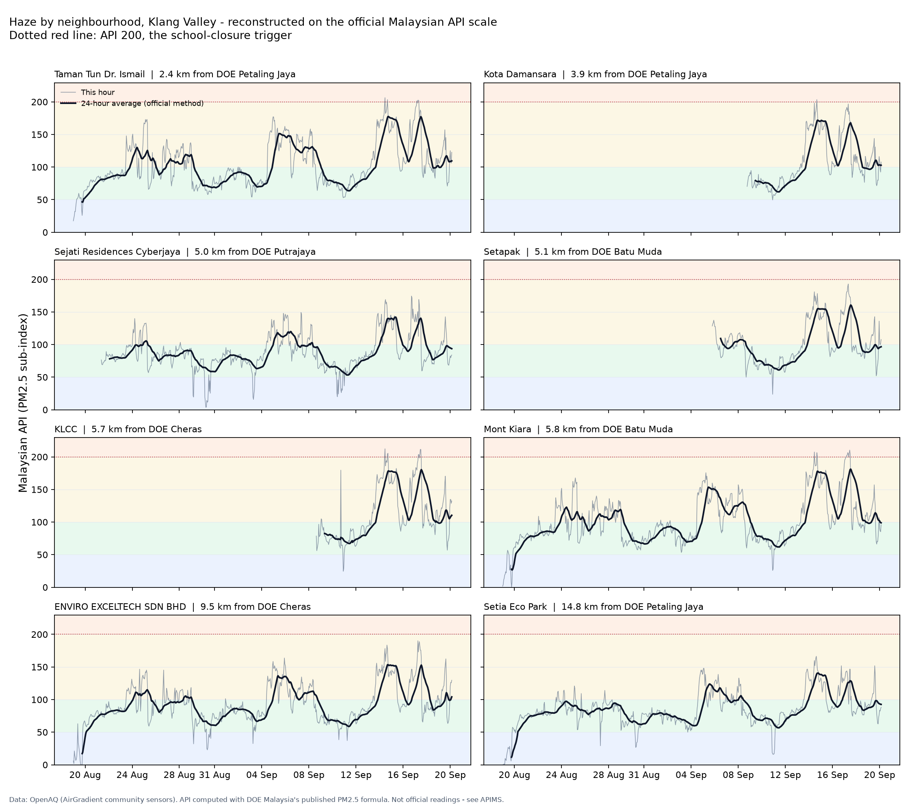

# Haze Watch MY

**Neighbourhood-level air quality for the Klang Valley, on Malaysia's official API scale.**

Malaysia's Air Pollutant Index (API) is published by the Department of Environment
through [APIMS](https://eqms.doe.gov.my/APIMS/main). It is authoritative, and it has
three properties that make it hard to act on:

| | |
|---|---|
| **It's an index, never a concentration** | You get `165`, never `123 µg/m³`. Nothing to compare against the WHO guideline, or against any app reporting PM2.5. |
| **PM2.5 uses a 24-hour rolling average** | The reading at 3pm describes the preceding day. It under-reads while smoke arrives and stays high after the air clears. [DOE documents this](https://www.doe.gov.my/wp-content/uploads/2021/09/API_Calculation.pdf) — it is deliberate, since health effects depend on exposure duration. |
| **~65 stations nationwide** | Most neighbourhoods have no station. Setapak and Cyberjaya — the two ends of my daily commute — have none. |

This pipeline takes hourly PM2.5 from community sensors, applies the DOE's own
published formula, and produces a reading for neighbourhoods the official network
does not cover — then checks that result against official readings.

---

## Results

Validated on **18 September 2026**, during an active haze episode, across 15 paired
observations at three separate hours.

**Five sensors within 6 km of an official station reproduced that station's API to
within 7.1 points on average, with a mean bias of +1.3.**

| Sensor | Distance to station | Mean abs. error | Bias |
|---|---|---|---|
| Kota Damansara | 3.9 km | 2.0 | −1.8 |
| Taman Tun Dr. Ismail | 2.4 km | 5.9 | +5.0 |
| Mont Kiara | 5.8 km | 7.4 | +7.4 |
| KLCC | 5.7 km | 8.4 | +8.4 |
| Setapak | 5.1 km | 12.5 | −12.5 |

Error grows with distance: −17 at 9.5 km, −37 at 14.8 km. A 6 km cutoff is applied
for that reason.

**Setapak peaked at API 161** — Unhealthy, for days, with no official station nearby.
Mont Kiara reached 181 and KLCC 180, both within 20 points of the API 200
school-closure threshold under the National Haze Action Plan.




---

## What it does

```
OpenAQ (AirGradient)  ──┐
                        ├──> raw JSON ──> PostgreSQL ──> DOE formula ──> API per site
Open-Meteo (CAMS)     ──┤                                      ▲
                        │                                      │
APIMS (by hand)       ──┘──────────────────────────────────────┘
                                                          validation
```

- **Ingests** hourly PM2.5 from 8 community sensors across the Klang Valley via the
  [OpenAQ v3 API](https://docs.openaq.org) — about 4,700 hourly readings.
- **Lands raw responses unmodified** in `raw/`, partitioned by date. Parsing mistakes
  are fixed by re-reading files, never by re-fetching data that may no longer exist.
- **Loads idempotently** into PostgreSQL. Re-running any day is safe; the primary key
  on `(sensor_id, measured_at, parameter)` turns a repeat load into an upsert.
- **Computes the 24-hour rolling average in SQL** with a window function
  (`RANGE BETWEEN INTERVAL '23 hours' PRECEDING`), matching the official method rather
  than approximating it. Hours with fewer than 18 of 24 readings produce no value.
- **Applies the DOE PM2.5 sub-index formula** (`api_subindex.py`) to put each site on
  the official Malaysian API scale.
- **Reverses the formula** too — an official reading of 165 implies a 24-hour average
  of 123 µg/m³, the concentration APIMS does not publish.
- **Validates** against APIMS readings recorded by hand. APIMS keeps no public archive,
  so those observations cannot be recovered once the hour passes.

## Stack

Python · PostgreSQL 16 · Docker Compose · SQL window functions · matplotlib

No orchestration yet — see [What's next](#whats-next).

---

## Running it

```bash
cp .env.example .env          # add your OpenAQ key and a Postgres password
docker compose up -d          # Postgres, schema applied on first start
python -m pip install -r requirements.txt

python discover_openaq.py     # find sensors near each DOE station
python fetch_openaq.py --days 30
python load_openaq.py
python load_manual.py         # hand-collected APIMS readings
python make_charts.py
```

`investigate_sensors.py` runs the sensor quality check described below.

---

## Limitations

Stated plainly, because they bound what the numbers mean.

- **Low-cost sensors, uncalibrated against each other.** Across the network, sites span
  a 37% range relative to the median (0.84 to 1.15). That is ordinary for consumer
  sensors with no cross-calibration — and at haze concentrations it is roughly ±24 API
  points of spread.
- **No co-located pairs.** The closest sensor is 2.4 km from its station. Every
  comparison measures sensor *and* distance together; they cannot be separated here.
- **One day of paired readings.** Fifteen observations at three hours. A starting
  point, not a validated accuracy figure.
- **One site is unresolved.** Sejati Residences Cyberjaya reads 0.84 of the network and
  sits 5 km from Putrajaya station, which was itself the highest official reading that
  day. `investigate_sensors.py` compares every site against the median of the others
  and cannot separate "sensor reads low" from "this area genuinely is cleaner" — its
  correlation with the network is 0.88, so it is measuring the same episodes, and its
  deviation is worse in daytime traffic hours (0.82) than overnight (0.88). Both
  explanations remain open.
- **Open-Meteo is kept for forecast shape only.** Its CAMS *analysis* tracks the
  sensors closely; its *forecast* diverged sharply during this episode, predicting
  clearing air roughly three days early. Magnitudes from the forecast are not used.

**This is not an official source.** For the authoritative reading, use
[APIMS](https://eqms.doe.gov.my/APIMS/main). Nothing here is health advice.

---

## What's next

- Airflow DAG so the pipeline runs daily without me
- dbt models with data quality tests, replacing the SQL in `make_charts.py`
- Per-sensor calibration factors fitted from accumulated paired readings — a single
  global formula demonstrably does not fit all sites
- More paired observations, especially on clean days, to test whether calibration
  holds outside haze conditions
- Automated APIMS capture, to replace the manual log

## Notes

[`docs/incidents.md`](docs/incidents.md) records what broke and how it was fixed,
including a conclusion I got wrong and had to retract.

## Data sources and attribution

- **PM2.5 measurements** — [OpenAQ](https://openaq.org), sourced from AirGradient
  community sensors. Licences vary by location; see each location record.
- **Modelled air quality** — [Open-Meteo](https://open-meteo.com), based on Copernicus
  Atmosphere Monitoring Service (CAMS) data. Free for non-commercial use.
- **API formula and bands** — Department of Environment Malaysia,
  [*Pengiraan Indeks Pencemar Udara*](https://www.doe.gov.my/wp-content/uploads/2021/09/API_Calculation.pdf).
- **Official readings** — recorded by hand from APIMS for validation only.

Built by [Lam Dasilah Hussain](https://linkedin.com/in/lam-dasilah).
